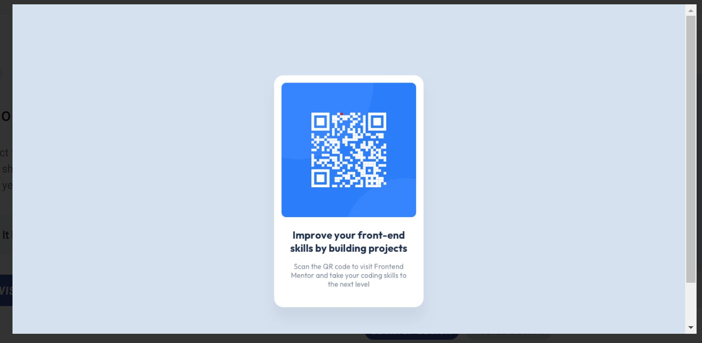

# Projeto QR Code do Frontend Mentor
    Projeto de card QR Code do frontend Mentor feito para práticar e estudar.

## Imagem do projeto do Frontend Mentor usado como base

## Tecnologias uilizadas
- HTML
- CSS

## Fonte e tamanho da letra
- Family: [Outfit](https://fonts.google.com/specimen/Outfit)
- Weights: 400, 700